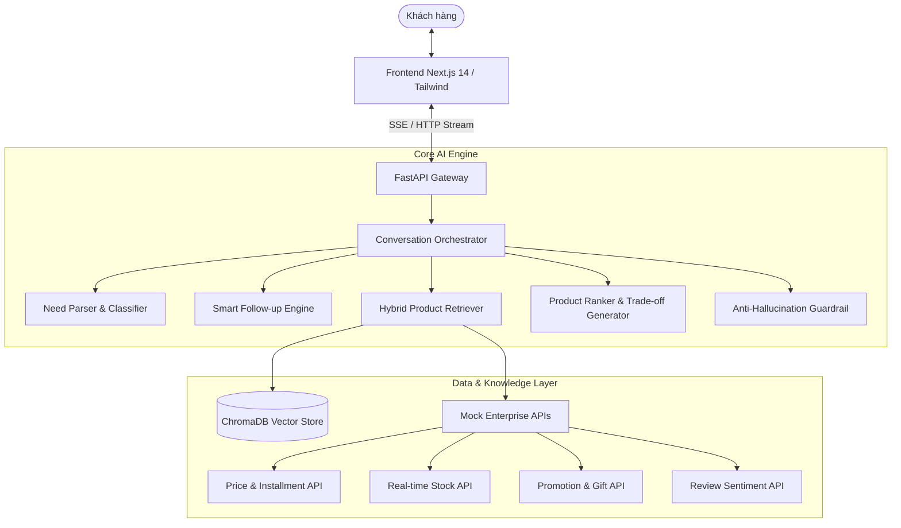

# Kiến trúc Kỹ thuật: Trợ lý AI So sánh & Tư vấn Sản phẩm (Điện Máy Xanh)

## 1. Tổng quan Kiến trúc

Hệ thống được thiết kế theo mô hình **AI-Native Orchestrated RAG** kết hợp các lớp **Domain Knowledge Engine** và **Strict Guardrail Layer** nhằm đảm bảo:
- Hiểu chính xác nhu cầu tự nhiên bằng Tiếng Việt (kể cả văn nói, viết tắt, đơn vị đo lường).
- Chủ động hỏi ngược (Smart Follow-up) khi thông tin chưa đủ điều kiện phân loại/lựa chọn.
- Xếp hạng đa tiêu chí (Multi-criteria Scoring) và phân tích trade-off dễ hiểu.
- Chống bịa đặt (Zero Hallucination) với cơ chế Fact-check và Source Citation rõ ràng.

---

## 2. Chi tiết các thành phần (Component Breakdown)

### 2.1. Conversation Orchestrator & State Machine
Quản lý trạng thái hội thoại khách hàng qua các giai đoạn:
1. `GREETING`: Chào hỏi và đón nhận yêu cầu ban đầu.
2. `NEED_COLLECTION`: Trích xuất nhu cầu qua `NeedParser`.
3. `FOLLOW_UP`: Nếu thiếu thông tin then chốt (ngân sách, số người, diện tích phòng), kích hoạt bộ câu hỏi gợi ý nhanh.
4. `RETRIEVAL`: Tìm kiếm vector + metadata filtering trong catalog.
5. `COMPARISON`: Xếp hạng top 3 sản phẩm & sinh lý giải đánh đổi (Trade-off Cards).
6. `DECISION_SUPPORT`: Hỗ trợ khách chốt phương án hoặc tùy biến tiêu chí.

### 2.2. Need Parser (Xử lý tiếng Việt chuyên sâu)
- Ánh xạ các thuật ngữ phổ thông và văn nói:
  - "nhà 4 người" $\rightarrow$ `household_size = 4` (tự động quy đổi dung tích tủ lạnh lý tưởng: $4 \times 80\text{L} - 100\text{L} \approx 320\text{L} - 400\text{L}$).
  - "phòng 18m2, hướng tây" $\rightarrow$ `room_area = 18`, `sun_exposure = True` (quy đổi máy lạnh $1.5\text{ HP} - 2.0\text{ HP}$).
  - "dưới 15 củ / 15 chai / 15tr" $\rightarrow$ `budget_max = 15,000,000 VND`.

### 2.3. Hybrid Product Retriever
- **Dense Retrieval**: Embedding mô tả và thuộc tính sản phẩm với ChromaDB.
- **Sparse / Rule Filtering**: Lọc cứng theo tầm giá (`budget_max`), thương hiệu yêu thích, kiểu dáng.

### 2.4. Product Ranker & Trade-off Generator
- Kết hợp điểm số nghiệp vụ (Domain Fit Score) và điểm độ tương đồng ngữ nghĩa:
$$\text{Score}_{\text{total}} = 0.6 \times \text{Score}_{\text{domain}} + 0.4 \times \text{Score}_{\text{semantic}}$$
- Sinh các thẻ so sánh:
  - `✅ Điểm mạnh`: Điểm nổi bật nhất theo đúng nhu cầu của khách.
  - `⚠️ Đánh đổi`: Những mặt hạn chế khách quan cần cân nhắc (giá cao hơn, tốn điện hơn, dung tích nhỏ hơn).
  - `💡 Tóm tắt`: 1 câu đúc kết giúp đưa ra quyết định nhanh.

### 2.5. Guardrail & Anti-Hallucination Layer
- Kiểm tra chéo mọi thông số, giá bán, quà tặng với database trước khi trả lời.
- Tuyệt đối không tự bịa giá hoặc tồn kho: nếu thiếu dữ liệu sẽ minh bạch thông báo: *"Hiện hệ thống chưa có thông tin tồn kho cho khu vực của anh/chị"*.
- Gắn nguồn dữ liệu trích dẫn `[Nguồn: Catalog Sản Phẩm]`, `[Nguồn: Price API]`.

---

## 3. Khả năng Mở rộng & Hiệu năng
- **Tốc độ phản hồi**: Gợi ý câu hỏi < 1.5s, bảng so sánh top 3 < 3.5s qua Server-Sent Events (SSE).
- **Multi-category ready**: Dễ dàng scale thêm các danh mục mới (Điện thoại, Tivi, Máy giặt, Robot hút bụi) chỉ bằng cách khai báo schema & rule file.
