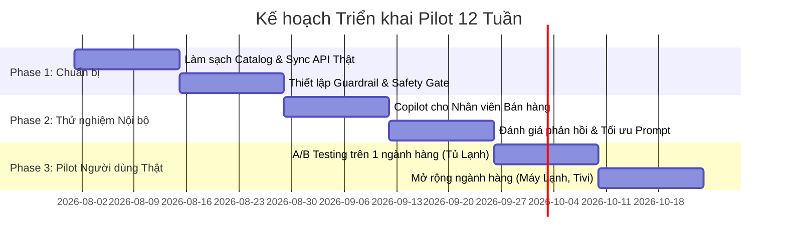

# Lộ trình Triển khai Thử nghiệm Thực tế (Pilot Roadmap)
**Dự án**: Trợ lý AI So sánh & Tư vấn Sản phẩm Theo Nhu Cầu Thật
**Đối tác triển khai**: Điện Máy Xanh (Thế Giới Di Động)

---

## 1. Mục tiêu & Chỉ số Đo lường (KPIs)

| Giai đoạn | Thời gian | Mục tiêu chính | KPI Đo lường |
|---|---|---|---|
| **Phase 1: Sandbox & Validation** | Tuần 1 - 4 | Tích hợp API thật (Catalog, Giá, Tồn kho, Khuyến mãi) | Tỷ lệ chính xác thông số > 99.5%, Zero Hallucination |
| **Phase 2: Closed Beta / Staff Pilot** | Tuần 5 - 8 | Triển khai công cụ Copilot cho nhân viên tư vấn cửa hàng/online | Giảm 40% thời gian tra cứu spec, Tăng 25% CSAT |
| **Phase 3: Live Pilot (A/B Testing)** | Tuần 9 - 12 | Mở cho 10.000 khách hàng thật trên web/app Điện Máy Xanh | Tăng tỉ lệ chuyển đổi (Conversion Rate) +15% |

---

## 2. Kế hoạch Triển khai Chi tiết (12 Tuần)

### Tuần 1 - 4: Tích hợp Hệ thống & Bảo mật Dữ liệu
- Kết nối trực tiếp vào Data Pipeline của Điện Máy Xanh: Product Catalog Service, Price Engine, ERP Inventory.
- Thiết lập cơ chế cache phân tán (Redis) để phản hồi trong vòng `< 800ms`.
- Bảo mật thông tin: Masking toàn bộ PII (thông tin định danh khách hàng), ẩn giá vốn nội bộ.

### Tuần 5 - 8: Copilot Mode cho Nhân viên Tư vấn (Internal Pilot)
- Nhân viên bán hàng tại siêu thị và đội ngũ tổng đài sử dụng trợ lý để tìm kiếm và so sánh sản phẩm tức thì khi khách hỏi các câu khó.
- Thu thập phản hồi từ chuyên gia ngành hàng (Category Manager) để hoàn thiện bộ câu hỏi gợi ý và quy tắc trade-off.

### Tuần 9 - 12: A/B Testing trên Kênh Online (dienmayxanh.com)
- Áp dụng A/B test 50/50 trên nhóm ngành hàng **Tủ Lạnh** và **Máy Lạnh**.
  - **Nhóm A (Control)**: Dùng bộ lọc truyền thống và chatbot kịch bản FAQ thông thường.
  - **Nhóm B (Experiment)**: Dùng **AI Comparison Advisor** với Need Summary Canvas và Trade-off Cards.
- Đánh giá tỉ lệ nhấp thêm vào giỏ hàng (Add-to-cart Rate) và tỉ lệ hoàn tất đơn hàng (Checkout Conversion).

---

## 3. Dự toán Chi phí Vận hành (Cost Estimation)

| Hạng mục | Quy mô (100.000 lượt hội thoại/tháng) | Chi phí ước tính (VND/tháng) |
|---|---|---|
| **LLM Inference (Gemini Flash / On-premise Lite)** | ~300.000 tokens/ngày | ~2.500.000 đ |
| **Vector DB & Search Cloud** | Chroma / Qdrant Dedicated Instance | ~1.500.000 đ |
| **App Server & Load Balancer** | 2x Cloud VM (8 vCPU, 16GB RAM) | ~4.000.000 đ |
| **Tổng chi phí vận hành** | **~8.000.000 đ / tháng** (Cực kỳ tối ưu cho bán lẻ) |

---

## 4. Kế hoạch Mở rộng sau Pilot (Rollout Strategy)
1. **Q3/2026**: Mở rộng toàn bộ 100% người dùng trên website cho ngành hàng Điện lạnh & Điện tử.
2. **Q4/2026**: Tích hợp vào Mobile App Điện Máy Xanh và Zalo Mini App.
3. **Q1/2027**: Mở rộng sang chuỗi **Thế Giới Di Động** (Điện thoại, Laptop, Tablet, Smartwatch).
